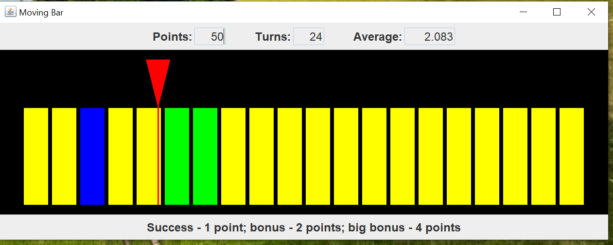
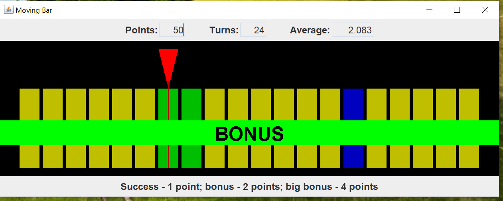

# Moving Bar
## Introduction
I decided to create a simple arcade-type game as an example.  Here's an image of the game.

The red pointer moves back and forth over the yellow, green, and blue bars. The pointer stops when you press the space bar.  

The yellow bars are success bars.  You get one point for stopping on the success bars.  The green bars are bonus bars.  You get two points for stopping on the bonus bars.  The blue bar is a big bonus bar.  You get four points for stopping on a big bonus bar.

Press the space bar to start the red pointer moving again.

The points and turn values are not saved.  They start at zero when you start the game.

## Explanation
Oracle has a helpful tutorial, [Creating a GUI With Swing](https://docs.oracle.com/javase/tutorial/uiswing/index.html).  Skip the Learning Swing with the NetBeans IDE section.

When I create a Swing application, I use the model-view-controller (MVC) pattern.  This pattern allows me to separate my concerns and focus on one part of the application at a time.  Here's what I mean by MVC in a Swing application.

- Model - One or more plain Java getter/setter classes.
- View - One Swing `JFrame` and as many `JPanels` and `JDialogs` as necessary to complete the application.  The view reads information from the model.  The view does not alter the model.
- Controller - Each `Action` or `Listener` is a controller.  A Swing application can have many controllers.  Each controller is responsible for updating part of the model and repainting the view.

The game has eight classes.  Two classes and an `enum` make up the model classes.  Two classes make up the view.  One for the `JFrame` and one for the drawing `JPanel`.  Three classes make up the controllers.  One of the controller classes is anonymous and is located in the drawing `JPanel` class.  One class controls the stepping of the `State` `enum` while the other moves the pointer.

You can change the speed of the pointer by modifying two `int` fields.  The `direction` field is the number of pixels per tick that the pointer moves.  The `timerTime` field is the number of milliseconds per tick.  This number must be at least 5 milliseconds per tick.

The images of the pointer, playing field, and result messages are all generated inside the drawing `JPanel` class.  They are generated once when the view is initialized and used when needed.

I made all the other classes inner classes so you can download the code as one block.
